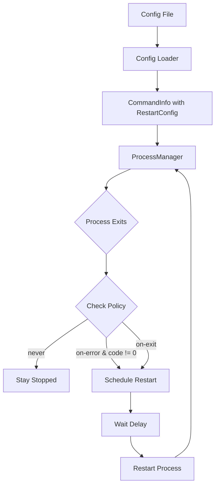

# Design Document: Process Restart Configuration

## Overview

This design adds automatic restart capabilities to conqr's process management. The feature introduces a `restart` configuration option that can be set globally (for all processes) or per-process, with per-process settings taking precedence. The implementation extends the existing `ProcessManager` class to handle restart logic based on exit conditions.

## Architecture

The restart feature integrates into the existing architecture with minimal changes:



### Key Design Decisions

1. **Restart config stored in CommandInfo**: Extend `CommandInfo` to include optional `restart` settings, keeping all process configuration together.

2. **Restart logic in ProcessManager**: The `ProcessManager` already handles process lifecycle events, so restart logic fits naturally in the `exit` handler.

3. **Simple timeout-based delay**: Use `setTimeout` for restart delays - simple and sufficient for this use case.

4. **Merge strategy**: Per-process restart config merges with global defaults using object spread, with per-process values winning.

## Components and Interfaces

### RestartConfig Interface

```typescript
interface RestartConfig {
  policy: 'never' | 'on-error' | 'on-exit';
  delay: number; // milliseconds
}
```

### Extended CommandInfo Interface

```typescript
interface CommandInfo {
  id: number;
  name: string;
  command: string;
  restart?: RestartConfig;
}
```

### Extended ConfigFile Interface

```typescript
interface ConfigFile {
  commands?: Array<string | CommandObject> | Record<string, string>;
  restart?: Partial<RestartConfig>; // Global defaults
}

interface CommandObject {
  name: string;
  command: string;
  restart?: Partial<RestartConfig>; // Per-process override
}
```

### ProcessManager Changes

The `ProcessManager` class gains:

1. **Restart scheduling**: Track pending restart timeouts per process
2. **Exit handler enhancement**: Check restart policy on process exit
3. **Cleanup on manual restart**: Cancel pending auto-restart if user manually restarts

```typescript
class ProcessManager extends EventEmitter {
  private restartTimeouts: Map<number, NodeJS.Timeout>;
  
  // New method
  private scheduleRestart(processId: number, delay: number): void;
  
  // Enhanced exit handler logic
  private handleExit(processId: number, code: number | null): void;
}
```

## Data Models

### Default Values

```typescript
const DEFAULT_RESTART_CONFIG: RestartConfig = {
  policy: 'never',
  delay: 1000 // 1 second default delay
};
```

### Config Resolution

The config resolution follows this precedence (highest to lowest):
1. Per-process `restart` settings
2. Global `restart` settings  
3. Default values (`policy: 'never'`, `delay: 1000`)

```typescript
function resolveRestartConfig(
  global?: Partial<RestartConfig>,
  perProcess?: Partial<RestartConfig>
): RestartConfig {
  return {
    ...DEFAULT_RESTART_CONFIG,
    ...global,
    ...perProcess
  };
}
```

### Example Configurations

**Global restart for all processes:**
```json
{
  "restart": {
    "policy": "on-error",
    "delay": 2000
  },
  "commands": ["npm run dev", "npm run worker"]
}
```

**Per-process override:**
```json
{
  "restart": {
    "policy": "on-error"
  },
  "commands": [
    "npm run dev",
    {
      "name": "Worker",
      "command": "npm run worker",
      "restart": {
        "policy": "on-exit",
        "delay": 5000
      }
    }
  ]
}
```

**Mixed with string commands:**
```json
{
  "restart": {
    "policy": "on-exit"
  },
  "commands": {
    "Dev": "npm run dev",
    "Build": "npm run build"
  }
}
```


## Correctness Properties

*A property is a characteristic or behavior that should hold true across all valid executions of a system—essentially, a formal statement about what the system should do. Properties serve as the bridge between human-readable specifications and machine-verifiable correctness guarantees.*

### Property 1: Config Resolution Precedence

*For any* global restart config and per-process restart config, the resolved config for a command SHALL have per-process values override global values, and global values override defaults.

**Validates: Requirements 1.1, 2.1, 2.2, 2.4**

### Property 2: On-Error Policy Behavior

*For any* process with `policy: "on-error"` and any exit code, the process SHALL be scheduled for restart if and only if the exit code is non-zero.

**Validates: Requirements 1.5**

### Property 3: On-Exit Policy Behavior

*For any* process with `policy: "on-exit"` and any exit code (including 0), the process SHALL always be scheduled for restart.

**Validates: Requirements 1.6**

## Error Handling

### Invalid Configuration

- **Invalid policy value**: If a policy value is not one of `"never"`, `"on-error"`, `"on-exit"`, the config loader should log an error and fall back to `"never"`
- **Negative delay**: If delay is negative, treat as 0 (immediate restart)
- **Non-numeric delay**: If delay is not a number, use default (1000ms)

### Process Restart Failures

- **Restart during shutdown**: If the application is shutting down (killAll called), pending restart timeouts should be cleared
- **Rapid exit loop**: No special handling needed per requirements (user chose not to include max restarts)

### Edge Cases

- **Manual restart while auto-restart pending**: Cancel the pending auto-restart timeout when user manually restarts
- **Process killed vs exited**: Treat SIGKILL/SIGTERM exits the same as normal exits for policy evaluation

## Testing Strategy

### Unit Tests

Unit tests should cover specific examples and edge cases:

1. **Config parsing**: Verify various config formats parse correctly
2. **Default behavior**: Verify no restart when config is absent
3. **Policy "never"**: Verify no restart scheduled
4. **Delay timing**: Verify correct delay value is used
5. **Log messages**: Verify restart messages are logged

### Property-Based Tests

Property tests validate universal properties across generated inputs:

1. **Config resolution**: Generate random global and per-process configs, verify merge precedence
2. **On-error policy**: Generate random exit codes, verify restart scheduled iff code != 0
3. **On-exit policy**: Generate random exit codes, verify restart always scheduled

**Test Configuration:**
- Minimum 100 iterations per property test
- Use a property-based testing library (e.g., fast-check)
- Tag format: **Feature: process-restart-config, Property {number}: {property_text}**

### Integration Tests

1. **End-to-end restart flow**: Start process, simulate exit, verify restart occurs
2. **Config file loading**: Load actual config files, verify restart behavior
